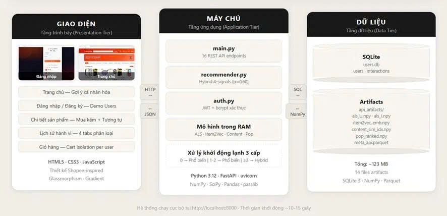
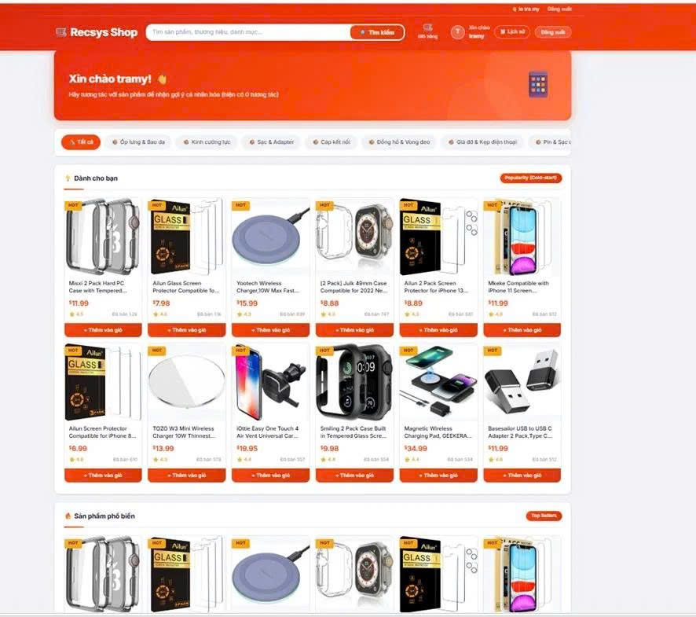
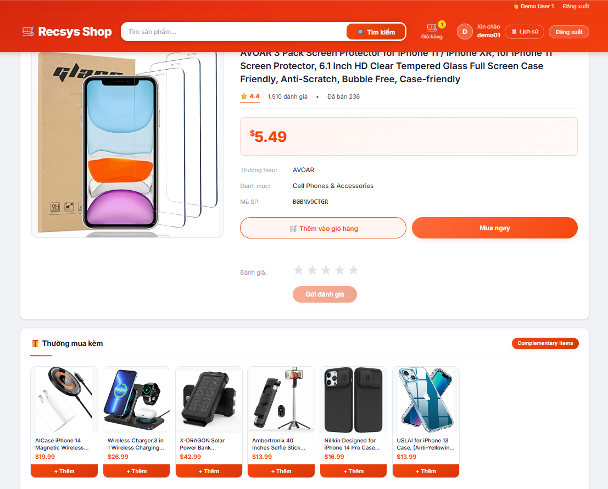
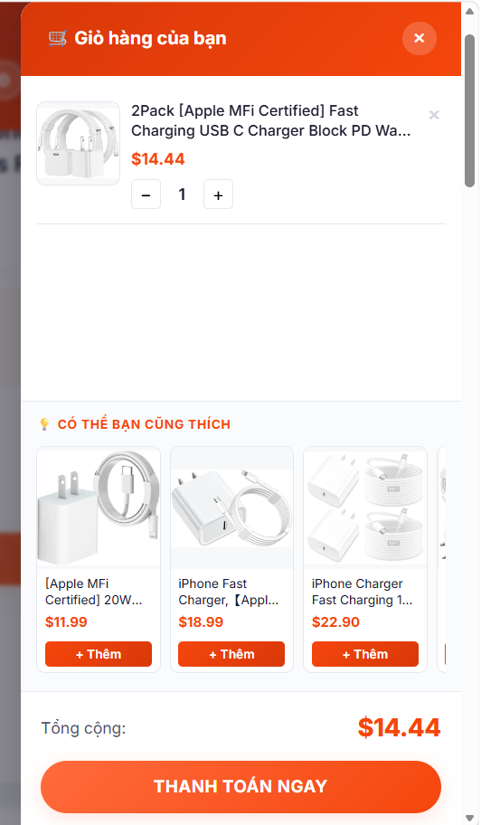
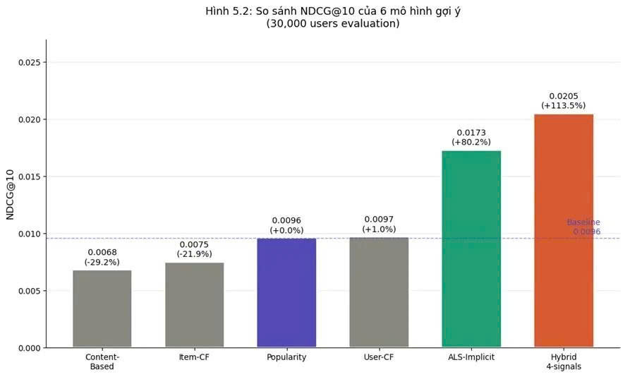

# RecSys Shop - Hệ thống gợi ý sản phẩm thương mại điện tử lai

## Giới thiệu

RecSys Shop là hệ thống gợi ý sản phẩm thương mại điện tử được xây dựng dựa trên dữ liệu hành vi người dùng từ bộ dữ liệu Amazon Reviews 2023.

Hệ thống kết hợp nhiều phương pháp gợi ý khác nhau nhằm nâng cao độ chính xác, đồng thời giải quyết các vấn đề phổ biến như dữ liệu thưa (sparsity) và cold-start.

## Mục tiêu

* Cá nhân hóa danh sách sản phẩm cho từng người dùng.
* Gợi ý các sản phẩm tương tự hoặc thường được mua cùng nhau.
* Hỗ trợ người dùng mới chưa có lịch sử tương tác.
* Xây dựng hệ thống demo gần với môi trường thương mại điện tử thực tế.

---

## Bộ dữ liệu

**Amazon Reviews 2023 – Cell Phones & Accessories**

### Thống kê dữ liệu

| Giai đoạn       | Kết quả            |
| --------------- | ------------------ |
| Dữ liệu ban đầu | 2.752.785 đánh giá |
| Sau Cutoff 2018 | 1.731.073 đánh giá |
| Sau K-Core 5/5  | 161.168 người dùng |
| Sau K-Core 5/5  | 54.110 sản phẩm    |
| Độ thưa dữ liệu | 99,987%            |

### Thuộc tính metadata sử dụng

* Title
* Features
* Categories
* Store

---

## Quy trình tiền xử lý

### Bước 1: Cutoff theo thời gian

Loại bỏ các đánh giá trước năm 2018 để giữ dữ liệu gần với xu hướng mua sắm hiện tại.

### Bước 2: K-Core Filtering (5/5)

Giữ lại:

* User có ít nhất 5 tương tác
* Item có ít nhất 5 tương tác

### Bước 3: Xử lý Metadata

Trích xuất các thuộc tính:

* Title
* Features
* Categories
* Store

để phục vụ mô hình Content-Based.

### Bước 4: Trọng số thời gian

Các tương tác gần đây được ưu tiên hơn tương tác cũ.

### Bước 5: Temporal Split

Chia dữ liệu theo thời gian:

* Train: 80%
* Test: 20%

---

## Các phương pháp gợi ý

### 1. Popularity

Gợi ý các sản phẩm phổ biến nhất.

### 2. Content-Based Filtering

Sử dụng TF-IDF và Cosine Similarity để tìm các sản phẩm có mô tả tương tự.

### 3. Item-Based Collaborative Filtering

Gợi ý dựa trên sự tương đồng giữa các sản phẩm.

### 4. User-Based Collaborative Filtering

Gợi ý dựa trên người dùng có hành vi tương tự.

### 5. ALS Implicit

Học các đặc trưng ẩn của người dùng và sản phẩm từ dữ liệu tương tác.

### 6. Item2Vec

Học biểu diễn sản phẩm từ chuỗi mua hàng bằng kiến trúc Skip-Gram.

### 7. Hybrid 4-Signals (Mô hình đề xuất)

Kết hợp:

* ALS (60%)
* Item2Vec (15%)
* Content-Based (15%)
* Popularity (10%)

Điểm cuối cùng:

Score = 0.60 × ALS + 0.15 × Item2Vec + 0.15 × Content + 0.10 × Popularity

---

## Cấu trúc dự án

```text
recsys-shop
│
├── backend
├── frontend
├── images
├── notebooks
├── scripts
│
├── README.md
└── requirements.txt
```

---

## Kết quả thực nghiệm

### So sánh NDCG@10

| Phương pháp      | NDCG@10 |
| ---------------- | ------- |
| Hybrid 4-Signals | 0.0205  |
| ALS Implicit     | 0.0173  |
| User-CF          | 0.0097  |
| Popularity       | 0.0096  |
| Item-CF          | 0.0075  |
| Content-Based    | 0.0068  |

Hybrid cải thiện **113,5%** so với mô hình Popularity.

---

## Kiến trúc hệ thống



---

## Giao diện trang chủ

Hệ thống hiển thị danh sách sản phẩm được cá nhân hóa theo từng người dùng.


---

## Gợi ý cho người dùng mới (Cold-Start)

Người dùng chưa có lịch sử tương tác sẽ nhận các sản phẩm phổ biến.



---

## Gợi ý mua kèm bằng Item2Vec

Các sản phẩm thường được mua cùng nhau được gợi ý tại trang chi tiết sản phẩm.



---

## Gợi ý từ giỏ hàng

Hệ thống đề xuất thêm sản phẩm dựa trên các sản phẩm đã có trong giỏ hàng.



---

## So sánh hiệu năng mô hình



---

## Công nghệ sử dụng

### Backend

* Python
* FastAPI
* SQLite

### Machine Learning

* ALS Implicit
* Item2Vec
* TF-IDF
* Collaborative Filtering

### Frontend

* HTML
* CSS
* JavaScript

### Môi trường phát triển

* Google Colab
* GPU Tesla T4

---

## Tác giả

**Lê Thị Trà My**

Ngành Khoa học Dữ liệu

Trường Đại học Công Thương TP. Hồ Chí Minh (HUIT)

---

## Đồ án tốt nghiệp

**Xây dựng hệ thống gợi ý sản phẩm thương mại điện tử áp dụng phương pháp lai dựa trên hành vi người dùng**
